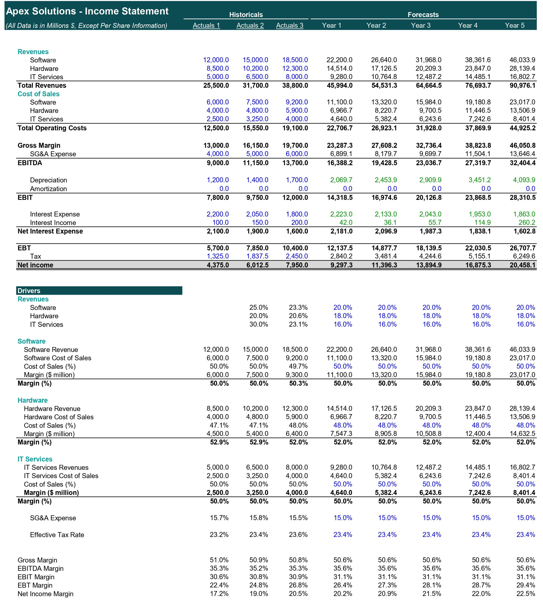
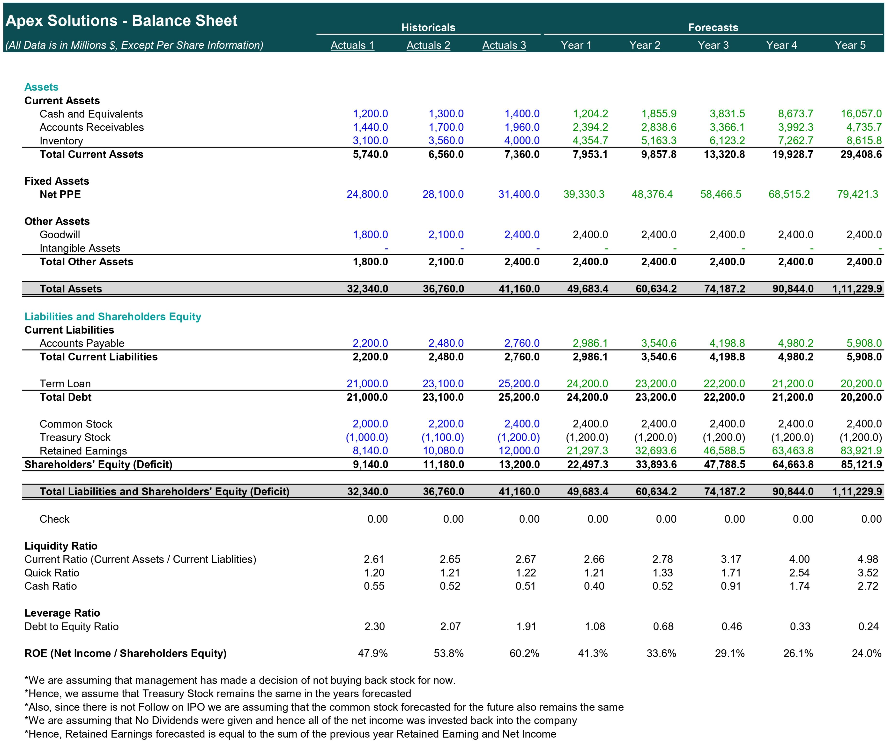
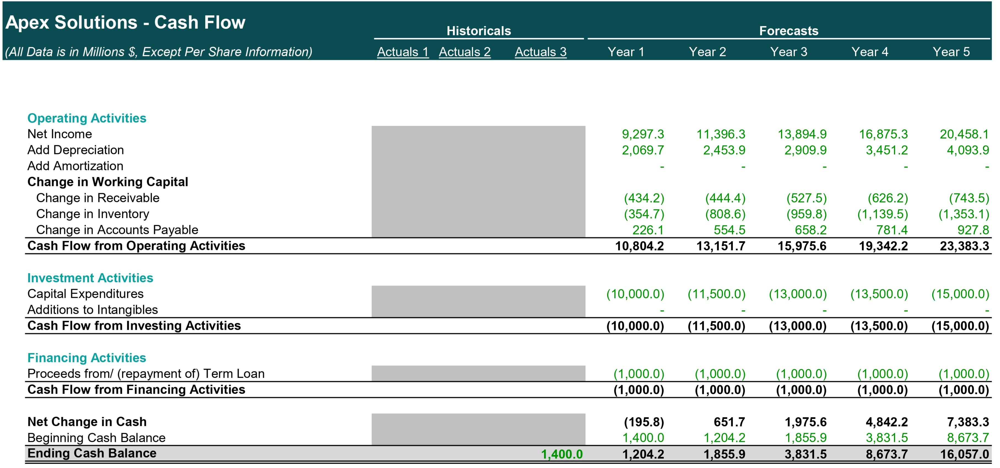
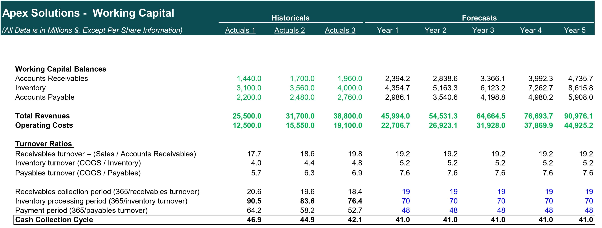
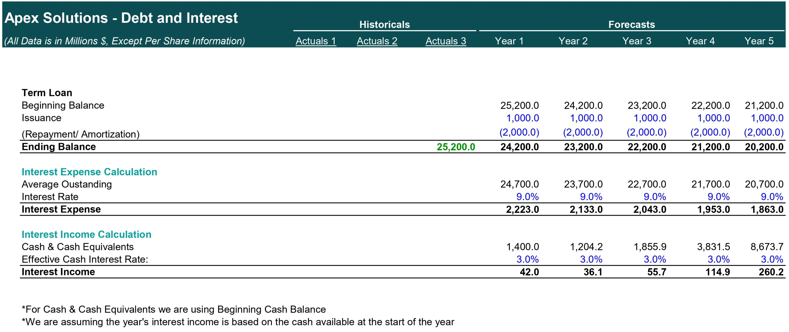
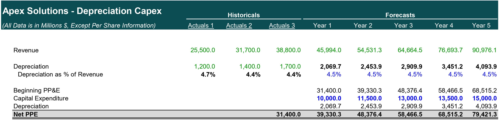
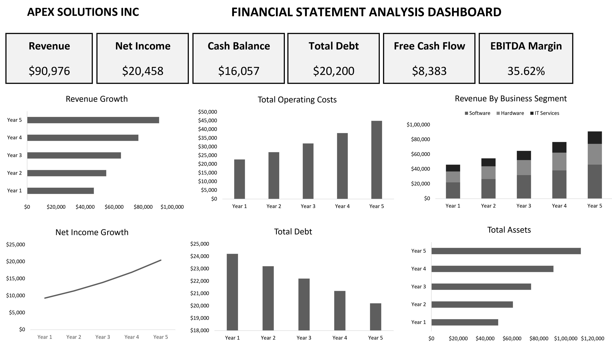

# Apex Solutions Inc. — Dynamic 3-Statement Financial Model

## Overview

This project presents a fully integrated dynamic 3-statement financial model built for Apex Solutions Inc., a global technology company operating across the Software, Hardware, and IT Services segments.

The model was developed as part of an equity research case study to evaluate the company’s projected financial performance, operational efficiency, liquidity position, and long-term growth potential over a 5-year forecast horizon.

```text
apex-solutions-financial-model/
│
├── Financial Modelling Of Apex Solutions.xlsx
├── Case Study of Apex Solutions.pdf
├── results/
└── README.md
```

## The project integrates:

* Income Statement

* Balance Sheet

* Cash Flow Statement

* Working Capital Schedule

* Debt & Interest Schedule

* Depreciation & CapEx Schedule

The model dynamically links all supporting schedules with the three core financial statements to ensure full financial integration and balance sheet consistency.

## Business Context

Apex Solutions Inc. is a multinational technology company providing:

* Enterprise Software Solutions

* Hardware Infrastructure Products

* IT & Cloud Services

Management’s guidance and assumptions from the MD&A section were incorporated into the forecasting process, including:

* Segment-level revenue growth projections

* Cost structure assumptions

* Working capital targets

* Debt repayment strategy

* CapEx planning

* Interest rate assumptions

The purpose of the model is to simulate the company’s future financial position and evaluate its ability to sustain growth while maintaining operational and financial stability.

## Project Objectives

The primary objectives of this financial model were:

* Build a fully integrated dynamic 3-statement financial model

* Forecast financial performance over a 5-year period

* Analyze profitability and operational efficiency

* Evaluate liquidity and cash flow generation

* Assess working capital management

* Model debt repayment and financing activities

* Understand the impact of operational assumptions on financial performance

## Financial Modeling Workflow

### Historical Financial Data Organization

The first step involved organizing and structuring the historical financial statements:

* Income Statement

* Balance Sheet

* Cash Flow Statement

The data was cleaned, standardized, and formatted for forecasting purposes.

## Revenue Forecasting by Business Segment

Revenue projections were built separately for each operating segment using management guidance from the case study.

Segment Growth Assumptions

| Segment     | Growth Rate |
|-------------|-------------|
| Software    | 20%         |
| Hardware    | 18%         |
| IT Services | 16%         |

This segment-driven forecasting approach allows for more realistic and operationally aligned projections compared to simple top-line growth assumptions.

## Cost Structure Forecasting

Segment-level cost assumptions were incorporated into the model.

Cost of Goods Sold (COGS)

| Segment     | COGS Assumption |
|-------------|----------------|
| Software    | 50% of Revenue |
| Hardware    | 48% of Revenue |
| IT Services | 50% of Revenue |

## SG&A Forecasting

Selling, General & Administrative Expenses (SG&A) were projected at:

15% of Total Revenue

This created a scalable operating expense structure tied directly to business growth.

## Depreciation & Capital Expenditure Modeling

A dedicated CapEx schedule was developed using management’s projected investment plan.

Planned Capital Expenditures

| Forecast Year | Planned CapEx |
|---------------|---------------|
| Year 1        | $10.0B        |
| Year 2        | $11.5B        |
| Year 3        | $13.0B        |
| Year 4        | $13.5B        |
| Year 5        | $15.0B        |

The schedule dynamically feeds:

* PP&E balances

* Depreciation expense

* Cash Flow Statement

* Balance Sheet projections

## Working Capital Forecasting

A dynamic working capital schedule was created using operational efficiency assumptions.

Working Capital Drivers

| Metric            | Assumption |
|-------------------|------------|
| Receivable Days   | 19 Days    |
| Inventory Days    | 70 Days    |
| Payable Days      | 48 Days    |

The schedule forecasts:

* Accounts Receivable

* Inventory

* Accounts Payable

These balances directly impact operating cash flows and liquidity analysis.

## Debt & Interest Schedule

A debt schedule was developed to model financing activities and interest calculations.

| Debt Assumption              | Value |
|------------------------------|-------|
| Annual Debt Repayment        | $2B   |
| Annual New Debt Issuance     | $1B   |
| Term Loan Interest Rate      | 9%    |
| Interest Earned on Cash      | 3%    |

The debt schedule dynamically calculates:

Debt balances
Interest expense
Interest income
Financing cash flows

## Integration of the Three Financial Statements

The model integrates:

* Income Statement

* Balance Sheet

* Cash Flow Statement

through dynamic formula linkages.

## Key integrations include:

* Net Income flowing into Retained Earnings

* Depreciation added back in CFO

* Working capital changes impacting operating cash flow

* Debt activity impacting financing cash flow

* Ending cash balances reconciling across statements

The model was built to ensure that:

* Cash flow movements reconcile properly

* Balance Sheet balances dynamically

* Financial statements remain fully linked

## Core Components

### Assumptions & Drivers

Contains:

* Revenue growth assumptions

* Margin assumptions

* Working capital assumptions

* Financing assumptions

* Supporting Schedules

Includes:

* Working Capital Schedule

* Debt Schedule

* Depreciation & CapEx Schedule

* Financial Statements

* Income Statement

* Balance Sheet

* Cash Flow Statement

---
## Financial Modelling Excel Sheets and Dashboard

### Income Statement



### Balance Sheet



### Cash Flow Statement



### Working Capital Schedule



### Debt Schedule



### Depreciation & CapEx Schedule



### Financial Analysis Dashboard



---

## Financial Concepts Implemented

### This project incorporates several core corporate finance and financial modeling concepts:


* Integrated 3-Statement Modeling

* Segment-Based Forecasting

* Working Capital Forecasting

* Debt & Interest Modeling

* Dynamic Cash Flow Reconciliation

* Retained Earnings Linkage

* CapEx & Depreciation Forecasting

* Liquidity Analysis

* Profitability Analysis

* Financing Activities Modeling

* Key Skills Demonstrated

* Financial Modeling

* Dynamic 3-statement integration

* Forecasting methodologies

* Supporting schedule construction

* Corporate Finance

* Capital structure analysis

* Working capital management

* Liquidity evaluation

* Excel Modeling

* Formula-driven dynamic modeling

* Financial statement linking

* Structured workbook architecture

* Financial Analysis

* Profitability analysis

* Operational efficiency analysis

* Cash flow analysis

## Tools Used

* Microsoft Excel

* Financial Modeling

* Corporate Finance Concepts

* Forecasting Techniques

* Financial Statement Analysis

* Repository Structure

## Conclusion

This project demonstrates the construction of a professional-style dynamic financial model used in equity research and corporate finance analysis.